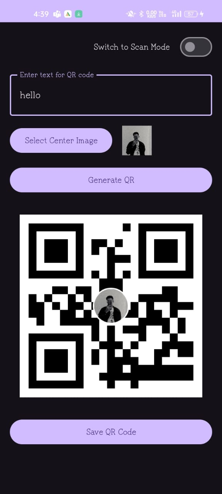
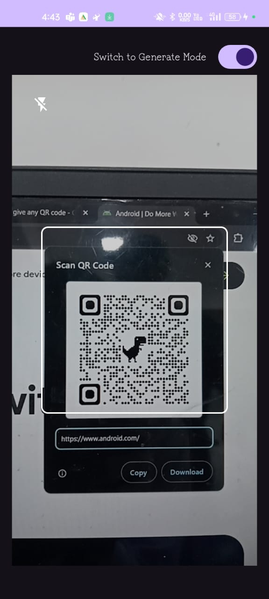
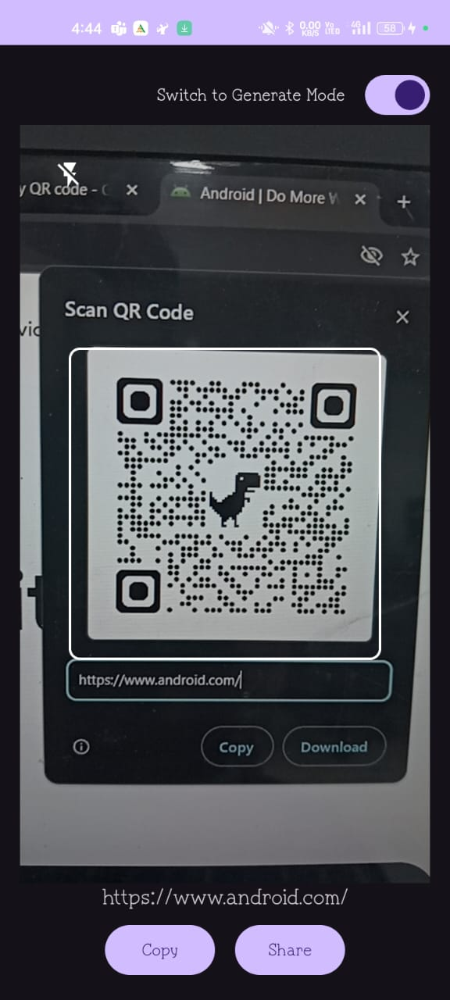

# QRCodeGenerator

A flexible Android library for generating and scanning QR codes, packed with customization options. This guide walks you through setup, usage, and best practices for both QR code generation and scanning in a smooth way.

## JitPack Setup (Necessary for JitPack CI and importing library) 

To get started, add the JitPack repository to your root settings file. This lets Gradle fetch the library for you.

```kotlin
// Put below code in your settings.gradle.kts (root) file of your project
dependencyResolutionManagement {
    repositoriesMode.set(RepositoriesMode.FAIL_ON_PROJECT_REPOS)
    repositories {
        google() // Recommended for Android projects
        mavenCentral()
        maven(url = "https://jitpack.io")
    }
}
```

## Gradle Dependency (Necessary for use library)

Add the library to your app-level `build.gradle`:

```gradle
// Put below code in your app/build.gradle (if you are using Groovy-DSL)
dependencies {
    implementation 'com.ext:qrcodelibrary:1.0.0'
}


// Put below code in your app/build.gradle.kts (if you are using Kotlin-DSL)
dependencies {
    implementation("com.ext:qrcodelibrary:1.0.0")
}
```

## Usage

Here's how to generate and scan QR codes, pass data in, and get results out.

### QR Code Generation with QRCodeView

Drop the `QRCodeView` into your layout and you're ready to go. You can set the content, tweak the look, and even add a logo or photo in the center.

```xml
<!-- Put below code in your layout XML -->
<com.ext.qrcodelibrary.QRCodeView
    android:id="@+id/qrCodeView"
    android:layout_width="match_parent"
    android:layout_height="wrap_content"
    app:qr_showTitle="false"
    app:qr_showImageSelection="false"
    app:qr_showDownloadButton="false"
    app:qr_foregroundColor="#0000FF"
    app:qr_backgroundColor="#FFFFFF"
    app:qr_codeSize="512dp"
    app:qr_overlaySize="0.2"
    app:qr_overlayBorderColor="#FFFFFF"
    app:qr_overlayBorderWidth="4dp" />
```

```kotlin
// Get the QRCodeView instance by below line and make sure id given by you is same as you are using in below line
val qrCodeView = findViewById<QRCodeView>(R.id.qrCodeView)

// Set the text or URL you want to encode
qrCodeView.setContent("https://example.com")

// Optional: Use below if you want customize colors, size, and overlay in your generated QR
qrCodeView.apply {
    setForegroundColor(Color.BLUE)
    setBackgroundColor(Color.WHITE)
    setCodeSize(512)
    setOverlaySize(0.2f)
    setOverlayBorderColor(Color.WHITE)
    setOverlayBorderWidth(4f)
}

// Optional: To add a center image (e.g., logo or profile pic)
qrCodeView.setCenterImage(bitmap)

// Necessary to Generate the QR code
qrCodeView.generateQRCode()

// Get the generated bitmap if you need it
val qrBitmap = qrCodeView.getQRCodeBitmap()

// To save the QR code in your local storage
qrCodeView.saveQRCode("MyQRCode.png") { uri ->
    // uri is the saved file location
}
```

### QR Code Scanning with QRScannerView

Add `QRScannerView` to your layout to scan QR codes in real time. Just set up a listener to get the result when a code is found.

```xml
<!-- Put below code in your layout XML for QR Scanning -->
<com.ext.qrcodelibrary.QRScannerView
    android:id="@+id/qrScannerView"
    android:layout_width="match_parent"
    android:layout_height="0dp"
    app:scanner_frame_color="#FFFFFF"
    app:scanner_frame_width="250dp"
    app:scanner_frame_height="250dp"
    app:scanner_frame_corner_radius="8dp"
    app:scanner_frame_stroke_width="2dp"
    app:scanner_overlay_color="#33000000" />
```

```kotlin
val qrScannerView = findViewById<QRScannerView>(R.id.qrScannerView)

// To Initialize the scanner (call this in onCreate or onViewCreated)
qrScannerView.initialize(lifecycleOwner)

// To get scan results from the scanned QR
qrScannerView.setOnQRCodeScannedListener { result ->
    // Do something with the scanned text like pass to an activity
    handleQRContent(result)
}

// Necessary for Start scanning when ready
qrScannerView.startScanning()

// For Stopping scanning when done (e.g., in onPause())
qrScannerView.stopScanning()

// You can also update the scanner's appearance
qrScannerView.apply {
    setFrameColor(Color.WHITE)
    setFrameSize(250f)
    setFrameCornerRadius(8f)
    setFrameStrokeWidth(2f)
    setOverlayColor(Color.parseColor("#33000000"))
}
```

## Permissions

Camera and storage permissions are needed for scanning and saving QR codes. Add these to your `AndroidManifest.xml`:

```xml
<uses-permission android:name="android.permission.CAMERA" />
<uses-permission android:name="android.permission.WRITE_EXTERNAL_STORAGE" 
    android:maxSdkVersion="28" />
<uses-permission android:name="android.permission.READ_MEDIA_IMAGES" />
<uses-feature android:name="android.hardware.camera.autofocus" />

```

To request permissions at runtime:

```kotlin
// To check and request permissions before scanning
private fun checkAndRequestPermissions() {
    if (qrScannerView.hasRequiredPermissions()) {
        qrScannerView.startScanning()
    } else {
        qrScannerView.requestPermissions(this)
    }
}

// For forwarding the result to the scanner
override fun onRequestPermissionsResult(
    requestCode: Int,
    permissions: Array<out String>,
    grantResults: IntArray
) {
    super.onRequestPermissionsResult(requestCode, permissions, grantResults)
    qrScannerView.handlePermissionResult(requestCode, permissions, grantResults)
}
```

## Error Handling

Set up error listeners to catch issues like invalid content, permission problems, or scan failures. This helps you show helpful messages to your users.

```kotlin
// For QR code generation
qrCodeView.setOnErrorListener { error ->
    when (error) {
        QRCodeError.INVALID_CONTENT -> // Show a message for invalid input
        QRCodeError.SAVE_FAILED -> // Handle save errors
        QRCodeError.IMAGE_TOO_LARGE -> // Warn if the image is too big
    }
}

// For scanning QR code
qrScannerView.setOnErrorListener { error ->
    when (error) {
        QRScannerError.CAMERA_PERMISSION_DENIED -> // Ask user to enable camera
        QRScannerError.CAMERA_INITIALIZATION_FAILED -> // Handle camera issues
        QRScannerError.SCAN_FAILED -> // Let user know if scan didn't work
    }
}
```

## Screenshots

Here's what the library looks like in action:

### 1. QR Code Generation with Center Image



*Generate a QR code with your own text and a custom image in the center. Great for branding or personal use.*

---

### 2. QR Code Scanning Mode (Empty)



*The scanner is ready to detect a QR code. Just point your camera and wait for the magic.*

---

### 3. QR Code Scanning Mode (Result Detected)



*Once a QR code is found, the result pops up and you can copy or share it instantly.*

## Features

- Custom colors, backgrounds, and center images for QR codes
- Glow effects and error correction options
- Real-time QR code scanning with CameraX
- Scan from images or the camera
- Save QR codes as high-quality PNGs
- Easy integration and customization

## Requirements

- Android API Level 26 or higher
- Kotlin 1.8+
- AndroidX libraries

## Dependencies

This library uses:
- ZXing for QR code generation
- ML Kit for barcode scanning
- CameraX for camera support
- AndroidX Core and AppCompat

## FAQ

**How do I add a logo or photo to my QR code?**  
Just use `setCenterImage(bitmap)` on your `QRCodeView`. The image will be centered and scaled automatically.

**What error correction level should I use?**  
`ErrorCorrectionLevel.H` is a good default, especially if you're adding a center image.

**What if scanning fails?**  
Check your permissions and lighting. The library will only call your result callback when a valid QR code is found.

## License

```
Copyright 2025 Excelsior Technologies

Licensed under the Apache License, Version 2.0 (the "License");
you may not use this file except in compliance with the License.
You may obtain a copy of the License at

    http://www.apache.org/licenses/LICENSE-2.0

Unless required by applicable law or agreed to in writing, software
distributed under the License is distributed on an "AS IS" BASIS,
WITHOUT WARRANTIES OR CONDITIONS OF ANY KIND, either express or implied.
See the License for the specific language governing permissions and
limitations under the License.
```

## Contributing

Pull requests are welcome! If you have ideas or bug fixes, feel free to open a PR.

## Support

If you run into issues or have questions, open an issue on GitHub.

[](https://jitpack.io/#yashraiyani098/QRCodeGenerator)
