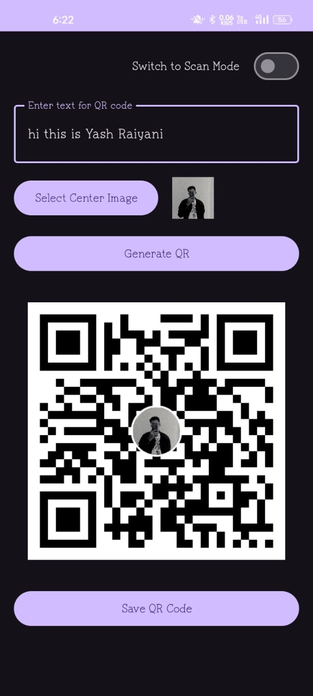
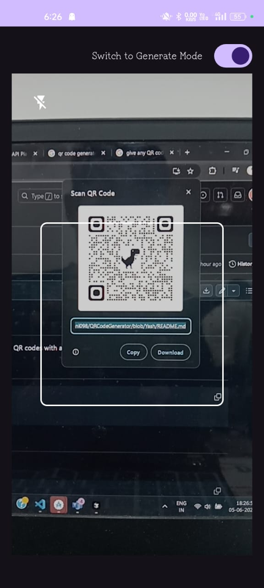
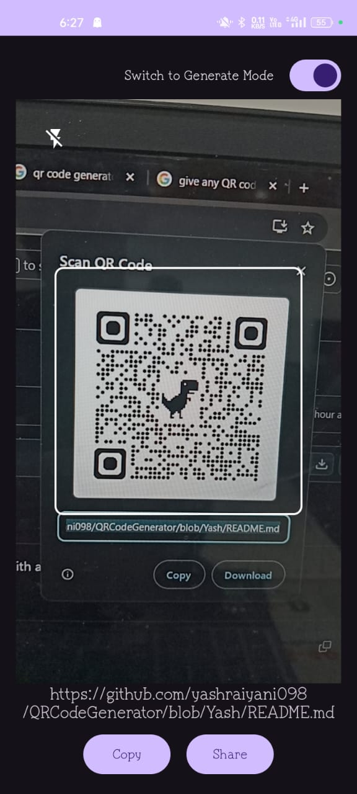

# QRCodeGenerator

A powerful and feature-rich Android library for generating and scanning QR codes with advanced customization options. This guide will help you integrate, use, and customize the library for both QR code generation and scanning, with clear explanations for every step.

## JitPack Setup

**Why:** To fetch the library from JitPack, you must add the JitPack repository to your project's root settings. This enables Gradle to resolve the library dependency.

**How to use:**
Add the following to your root `settings.gradle` (or `settings.gradle.kts` for Kotlin DSL):

```kotlin
dependencyResolutionManagement {
    repositoriesMode.set(RepositoriesMode.FAIL_ON_PROJECT_REPOS)
    repositories {
        google() // Optional but recommended for Android projects
        mavenCentral()
        maven(url = "https://jitpack.io")
    }
}
```

## Gradle Dependency

**Why:** This step adds the QR code library to your app, making all its features available in your project.

**How to use:**
Add this to your app-level `build.gradle`:

```gradle
dependencies {
    implementation 'com.ext:qrcodelibrary:1.9.0'
}
```

## Usage

This section covers how to generate and scan QR codes, including how to pass data to the library and retrieve results.

### QR Code Generation with QRCodeView

**What:** Generate QR codes with custom content, colors, and center images using the QRCodeView.

**How to use:**
1. Add `QRCodeView` to your XML layout.
2. In your Activity/Fragment, get a reference to the view.
3. Set the content and customize appearance.
4. Call `generateQRCode()` to create the QR code.
5. Use `getQRCodeBitmap()` to retrieve the image, or `saveQRCode()` to save it.

**Example:**

```xml
<!-- In your layout XML -->
<com.ext.qrcodelibrary.QRCodeView
    android:id="@+id/qrCodeView"
    android:layout_width="match_parent"
    android:layout_height="wrap_content"
    app:qr_showTitle="false"
    app:qr_showImageSelection="false"
    app:qr_showDownloadButton="false"
    app:qr_foregroundColor="#0000FF"
    app:qr_backgroundColor="#FFFFFF"
    app:qr_codeSize="512dp"
    app:qr_overlaySize="0.2"
    app:qr_overlayBorderColor="#FFFFFF"
    app:qr_overlayBorderWidth="4dp" />
```

```kotlin
// In your Activity/Fragment
val qrCodeView = findViewById<QRCodeView>(R.id.qrCodeView)

// Set QR code content (input)
qrCodeView.setContent("https://example.com")

// Customize appearance (optional)
qrCodeView.apply {
    setForegroundColor(Color.BLUE)
    setBackgroundColor(Color.WHITE)
    setCodeSize(512)
    setOverlaySize(0.2f)
    setOverlayBorderColor(Color.WHITE)
    setOverlayBorderWidth(4f)
}

// Add a center image (optional)
qrCodeView.setCenterImage(bitmap)

// Generate the QR code
qrCodeView.generateQRCode()

// Get the generated QR code bitmap (output)
val qrBitmap = qrCodeView.getQRCodeBitmap()

// Save the QR code to storage (output)
qrCodeView.saveQRCode("MyQRCode.png") { uri ->
    // Handle saved QR code URI
}
```

### QR Code Scanning with QRScannerView

**What:** Scan QR codes in real-time using the camera, and handle the scanned data in your app.

**How to use:**
1. Add `QRScannerView` to your XML layout.
2. In your Activity/Fragment, get a reference to the view.
3. Initialize the scanner and set a result listener.
4. Start scanning and handle results in the callback.
5. Stop scanning when done.

**Example:**

```xml
<!-- In your layout XML -->
<com.ext.qrcodelibrary.QRScannerView
    android:id="@+id/qrScannerView"
    android:layout_width="match_parent"
    android:layout_height="0dp"
    app:scanner_frame_color="#FFFFFF"
    app:scanner_frame_width="250dp"
    app:scanner_frame_height="250dp"
    app:scanner_frame_corner_radius="8dp"
    app:scanner_frame_stroke_width="2dp"
    app:scanner_overlay_color="#33000000" />
```

```kotlin
// In your Activity/Fragment
val qrScannerView = findViewById<QRScannerView>(R.id.qrScannerView)

// Initialize scanner (required)
qrScannerView.initialize(lifecycleOwner)

// Set scan result callback (output)
qrScannerView.setOnQRCodeScannedListener { result ->
    // Handle scanned result (output)
    handleQRContent(result)
}

// Start scanning
qrScannerView.startScanning()

// Stop scanning when done
qrScannerView.stopScanning()

// Customize scanner appearance (optional)
qrScannerView.apply {
    setFrameColor(Color.WHITE)
    setFrameSize(250f)
    setFrameCornerRadius(8f)
    setFrameStrokeWidth(2f)
    setOverlayColor(Color.parseColor("#33000000"))
}
```

## Permissions

**Why:** Camera and storage permissions are required for scanning QR codes and saving generated images.

**How to use:**
Add these permissions to your `AndroidManifest.xml`:

```xml
<uses-permission android:name="android.permission.CAMERA" />
<uses-permission android:name="android.permission.WRITE_EXTERNAL_STORAGE" 
    android:maxSdkVersion="28" />
```

**Requesting permissions at runtime:**

```kotlin
// Check and request permissions before starting scanner
private fun checkAndRequestPermissions() {
    if (qrScannerView.hasRequiredPermissions()) {
        qrScannerView.startScanning()
    } else {
        qrScannerView.requestPermissions(this)
    }
}

// Handle permission result
override fun onRequestPermissionsResult(
    requestCode: Int,
    permissions: Array<out String>,
    grantResults: IntArray
) {
    super.onRequestPermissionsResult(requestCode, permissions, grantResults)
    qrScannerView.handlePermissionResult(requestCode, permissions, grantResults)
}
```

## Error Handling

**Why:** To provide a smooth user experience, handle errors for both QR code generation and scanning.

**How to use:**
Set error listeners to catch and respond to issues such as invalid content, permission denial, or scan failures.

```kotlin
// QR Generation Errors
qrCodeView.setOnErrorListener { error ->
    when (error) {
        QRCodeError.INVALID_CONTENT -> // Handle invalid content
        QRCodeError.SAVE_FAILED -> // Handle save failure
        QRCodeError.IMAGE_TOO_LARGE -> // Handle large image
    }
}

// QR Scanning Errors
qrScannerView.setOnErrorListener { error ->
    when (error) {
        QRScannerError.CAMERA_PERMISSION_DENIED -> // Handle permission denied
        QRScannerError.CAMERA_INITIALIZATION_FAILED -> // Handle camera init failure
        QRScannerError.SCAN_FAILED -> // Handle scan failure
    }
}
```

## Screenshots

**What:** Visual examples of the library in action, showing both QR code generation and scanning modes.

### 1. QR Code Generation with Center Image



*This screen shows the QR code generation mode. Users can enter text, select a center image (such as a profile photo), and generate a QR code with the image embedded in the center. The generated QR code can be saved to the device.*

---

### 2. QR Code Scanning Mode (Empty)



*This screen displays the QR code scanning mode before a QR code is detected. The camera preview is active, and the scanning frame is visible, ready to scan any QR code.*

---

### 3. QR Code Scanning Mode (Result Detected)



*This screen shows the scanning mode after a QR code has been detected. The scanned content is displayed below the frame, and users can copy or share the result directly from the app.*

## Features

**What:** A summary of the main features provided by the library.

- 🎨 **Customizable QR Code Generation**
  - Custom colors for QR code and background
  - Center image support with circular border
  - Glow effect option
  - Adjustable error correction levels
  - Customizable size

- 📱 **QR Code Scanning**
  - Real-time QR code scanning using CameraX
  - Support for scanning QR codes from images
  - Customizable scan area
  - ML Kit integration for improved accuracy

- 💾 **Storage & Export**
  - Save QR codes to device gallery
  - High-quality PNG export
  - Automatic file naming

## Requirements

**What:** Minimum requirements for using the library.

- Android API Level 26+
- Kotlin 1.8+
- AndroidX

## Dependencies

**What:** Libraries used internally by this library.

- ZXing for QR code generation
- ML Kit for barcode scanning
- CameraX for camera functionality
- AndroidX Core and AppCompat

## FAQ

**What:** Answers to common questions about using the library.

**How can I add a custom center image to my QR code?**
You can use the `centerImage` parameter in `QRConfig` to add any bitmap as a center image. The image will be automatically scaled and centered in the QR code.

**What's the best error correction level to use?**
For most use cases, `ErrorCorrectionLevel.H` (High) is recommended as it provides the best error correction capability, especially when adding a center image.

**How can I handle scanning failures?**
The library includes built-in error handling. For real-time scanning, the callback will only be triggered when a valid QR code is detected. For image scanning, the result will be null if scanning fails.

## License

**What:** License and usage terms for the library.

```
Copyright 2025 Excelsior Technologies
```

## Contributing

**What:** How to contribute to the project.

Contributions are welcome! Please feel free to submit a Pull Request.

## Support

**What:** Where to get help or report issues.

If you encounter any issues or have questions, please open an issue in the GitHub repository.

[](https://jitpack.io/#yashraiyani098/QRCodeGenerator)
